# 👕 Website Bán Quần Áo - ASP.NET Core MVC

## 📌 Giới thiệu

Đây là dự án **website bán quần áo online** được xây dựng bằng ASP.NET Core MVC.
Hệ thống cho phép người dùng duyệt sản phẩm, thêm vào giỏ hàng, đặt hàng và thanh toán trực tuyến qua VNPAY (sandbox).

---

## 🎯 Mục tiêu

* Xây dựng hệ thống bán hàng cơ bản
* Áp dụng mô hình MVC
* Kết nối cơ sở dữ liệu MySQL
* Tích hợp thanh toán online (VNPAY)

---

## ⚙️ Công nghệ sử dụng

* ASP.NET Core MVC
* Entity Framework Core (ORM)
* MySQL (Database)
* Bootstrap 5 (UI)
* VNPAY Sandbox API (Thanh toán)
* C# (OOP, LINQ)
* JSON (Session giỏ hàng)

---

## 🔥 Chức năng chính

### 👤 Người dùng

* Đăng ký / Đăng nhập
* Xem danh sách sản phẩm quần áo
* Tìm kiếm sản phẩm
* Xem chi tiết sản phẩm
* Thêm sản phẩm vào giỏ hàng
* Đặt hàng
* Thanh toán online qua VNPAY
* Nhập địa chỉ giao hàng

---

### 🛠️ Quản trị viên (Admin)

* Quản lý sản phẩm (CRUD)
* Quản lý kích cỡ, màu sắc, loại sản phẩm
* Quản lý đơn hàng & chi tiết đơn hàng
* Cập nhật trạng thái thanh toán
* Cập nhật trạng thái đơn hàng
* Quản lý tài khoản người dùng

---

## 💳 Thanh toán VNPAY

Hệ thống tích hợp cổng thanh toán VNPAY để giả lập giao dịch.

### 🧪 Thông tin test

* Ngân hàng: NCB
* Số thẻ: 9704198526191432198
* Tên chủ thẻ: NGUYEN VAN A
* Ngày phát hành: 07/15
* OTP: 123456

👉 Lưu ý: Đây là môi trường sandbox, không trừ tiền thật.

---

## 🗄️ Cơ sở dữ liệu

* Sử dụng MySQL
* Mở file DataBase để lấy file `webbanquanao.sql` để import vào MySQL
* File: `webbanquanao.sql`

### 📥 Hướng dẫn import database

1. Mở MySQL Workbench
2. Chọn **Server → Data Import**
3. Chọn **Import from Self-Contained File**
4. Chọn file `webbanquanao.sql`
5. Chọn database `WebBanHang` (hoặc tạo mới)
6. Nhấn **Start Import**

### 📊 Các bảng chính

* TaiKhoan
* SanPham
* GioHang
* DonHang
* ChiTietDonHang
* ChiTietGioHang
* ChiTietSanPham
* DiaChi
* KichCo
* MauSac
* LoaiSanPham
* YeuThich

---

## 🚀 Hướng dẫn cài đặt & chạy project

### 1️⃣ Clone project

```bash
git clone https://github.com/ChiNhonn/WebQuanLyBanQuanAo.git
```

---

### 2️⃣ Cấu hình database

* Import file `.sql` vào MySQL
* Cập nhật connection string trong `appsettings.json`

```json
"ConnectionStrings": {
  "MyDB": "server=127.0.0.1;database=WebBanHang;user=root;password=123456"
}
```

---

### 3️⃣ Cấu hình VNPAY

```json
"Vnpay": {
  "TmnCode": "XXB5H2YT",
  "HashSecret": "H944JT2E353HU4VZFT9UKA5A697J2LYF",
  "BaseUrl": "https://sandbox.vnpayment.vn/paymentv2/vpcpay.html",
  "ReturnUrl": "https://localhost:7169/DonHang/PaymentCallback"
}
```

---

### 4️⃣ Chạy project

* Mở bằng Visual Studio
* Nhấn **F5** để chạy

---

## 🔄 Quy trình đặt hàng

```
Chọn sản phẩm → Thêm giỏ hàng → Đặt hàng → Chọn VNPAY → Thanh toán → Xác nhận
```

---

## 📸 Hình ảnh demo


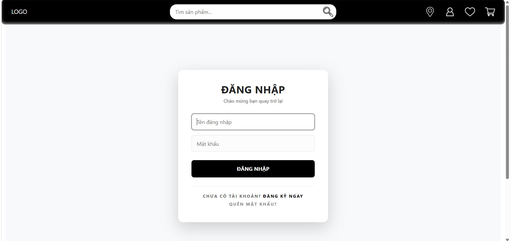
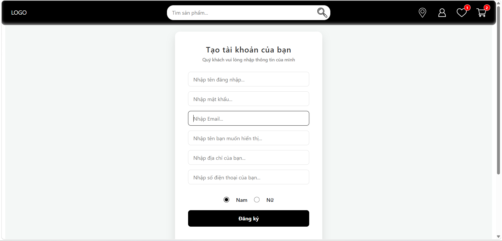
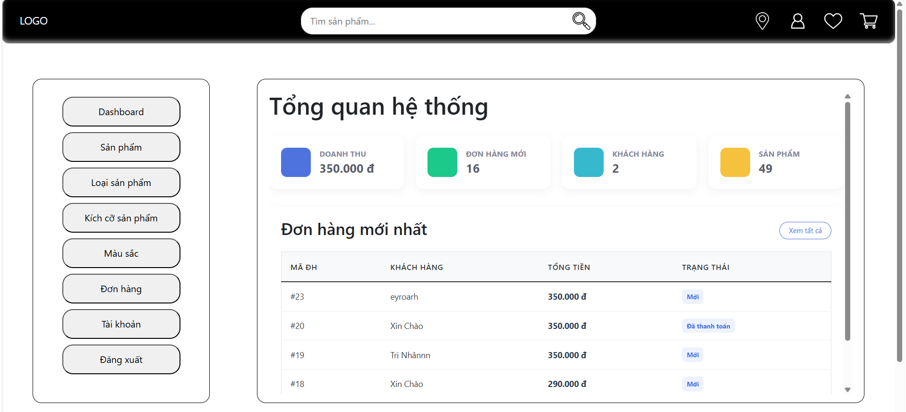
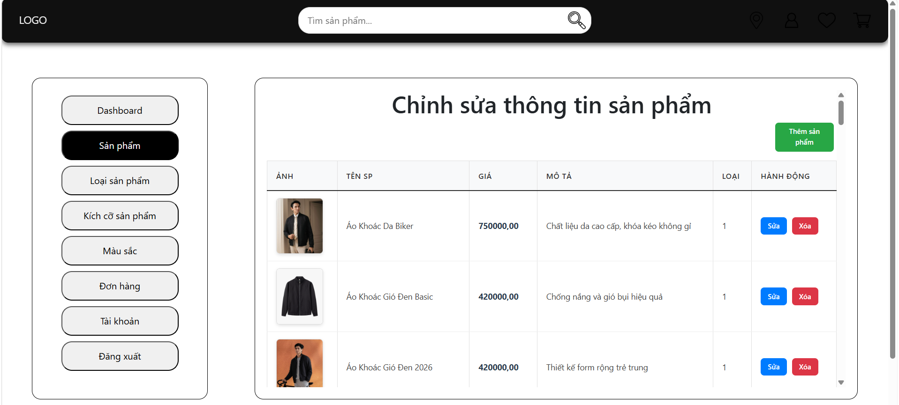
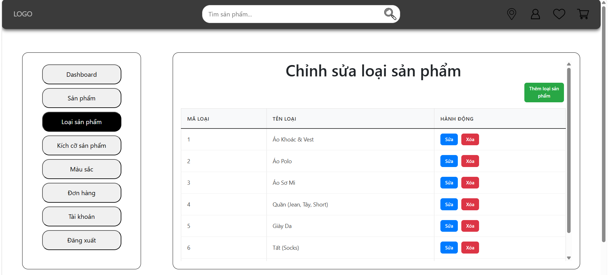
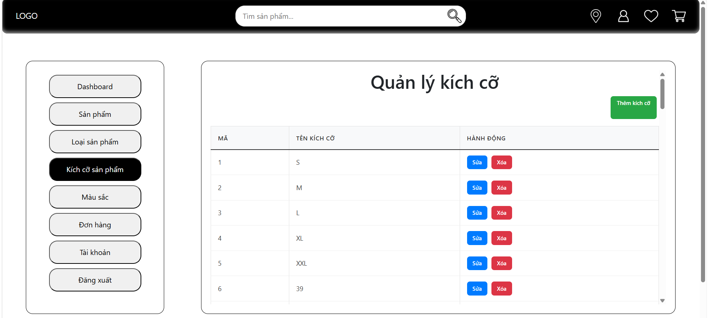
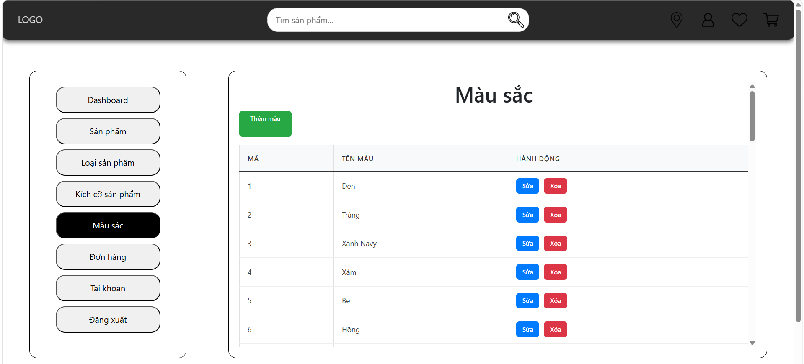
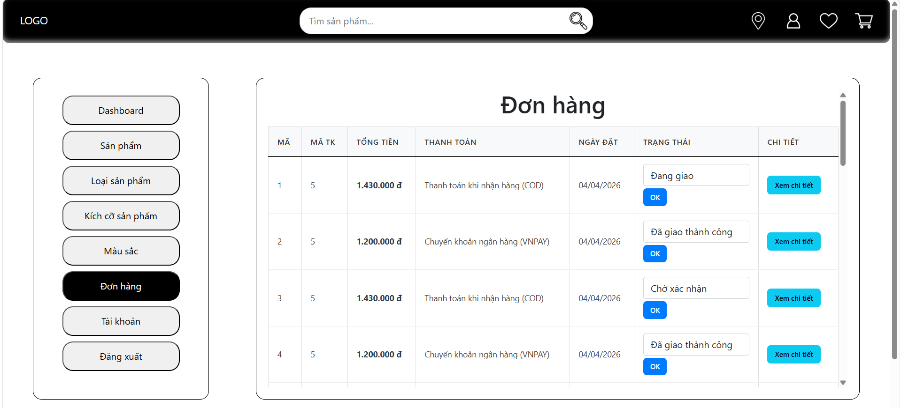
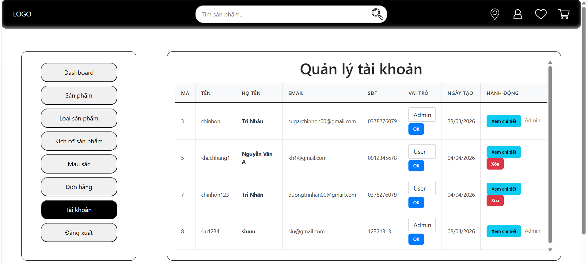
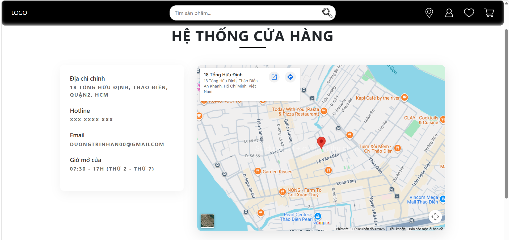
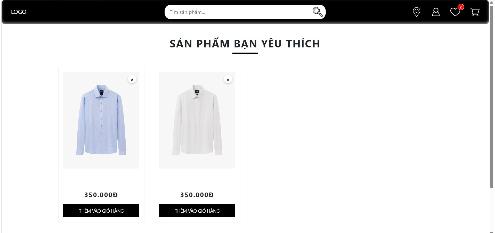
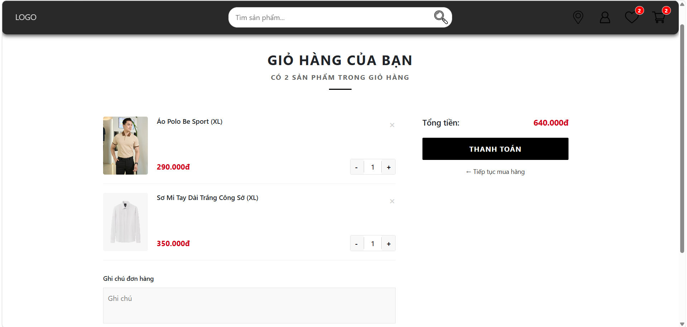
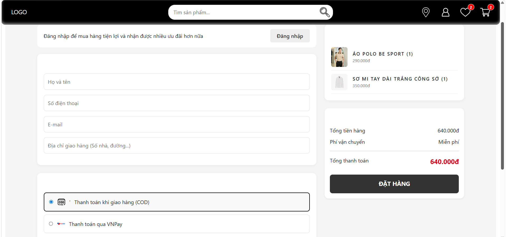


## 📊 Sơ đồ hệ thống

* Sơ đồ ERD (MySQL Workbench)
* 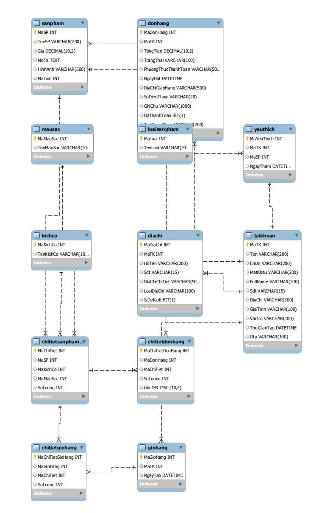
* Luồng xử lý thanh toán VNPAY

---

## 👨‍💻 Tác giả

* Tên: Đường Tri Nhân
* Ngành: Công nghệ thông tin

---

## 📄 License

Dự án phục vụ mục đích học tập.
